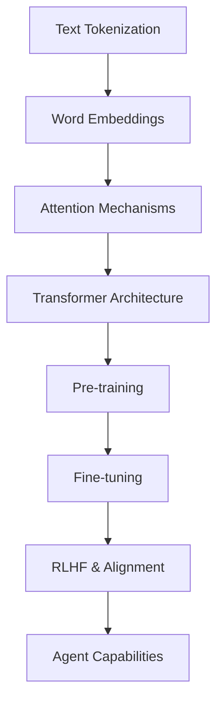

# LLM Fundamentals

Core concepts and techniques for understanding and working with Large Language Models.

## 🎯 Overview

This section covers the fundamental concepts you need to understand how Large Language Models work, from basic text representation to advanced evaluation techniques.

## 📚 Topics Covered

### Core Concepts
- **[Introduction to LLMs](llm-fundamentals.md)** - What are LLMs and how do they work?
- **[Word Embeddings](word-embeddings.md)** - How text becomes vectors
- **[Evaluation Methods](evaluation.md)** - How to measure LLM performance

## 🧠 Key LLM Concepts

Understanding these fundamentals is essential:

| Concept | Description | Why Important |
|---------|-------------|---------------|
| **Tokenization** | Converting text to numbers | Foundation of all LLM processing |
| **Embeddings** | Vector representations of text | How models understand meaning |
| **Attention** | Focusing on relevant parts | Core mechanism of Transformers |
| **Generation** | Creating new text | Primary capability of LLMs |
| **Evaluation** | Measuring performance | Ensuring quality and safety |

## 🏥 Healthcare Applications

LLM fundamentals are crucial for healthcare AI:

- **Medical text processing** - Understanding clinical notes and literature
- **Terminology handling** - Working with medical vocabularies
- **Safety evaluation** - Ensuring reliable performance in medical contexts
- **Bias detection** - Identifying and mitigating harmful biases

## 🔄 From Fundamentals to Advanced

These concepts build toward advanced topics:

## 🎯 Learning Objectives

After studying these materials, you'll understand:

- ✅ How text is converted to numerical representations
- ✅ What embeddings are and how they capture meaning
- ✅ How to evaluate LLM performance effectively
- ✅ The relationship between different LLM components
- ✅ Healthcare-specific considerations for LLMs

## 📈 Learning Path

**Recommended Order:**

1. **[Introduction to LLMs](llm-fundamentals.md)** - Start with the big picture
2. **[Word Embeddings](word-embeddings.md)** - Understand text representation
3. **[Evaluation Methods](evaluation.md)** - Learn to measure performance

**Time Investment:** 3-4 hours for comprehensive understanding

## 🔗 Connections to Other Topics

These fundamentals connect to:

- **[Mathematical Foundations](../math/index.md)** - The math behind the concepts
- **[Machine Learning](../ml/index.md)** - RL techniques for LLM training
- **[Study Guide](../../study-guide/index.md)** - Structured learning curriculum

---

**Ready to learn?** Start with [Introduction to LLMs](llm-fundamentals.md) to build your foundation in language model concepts.
