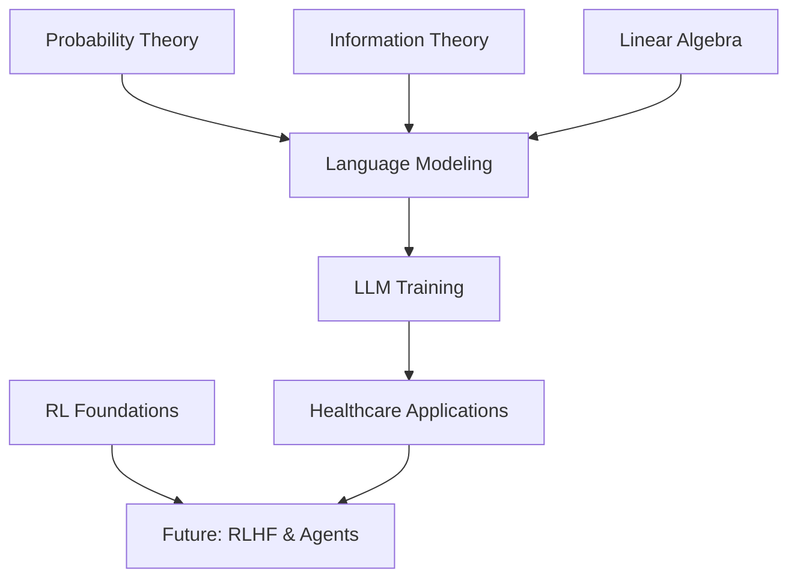

# Mathematical Foundations - Week 1

This page provides an overview of the mathematical concepts essential for understanding Large Language Models. These foundations will be built upon throughout the entire curriculum.

## 🎯 Overview

The mathematical foundations for Week 1 focus on four key areas that underpin language modeling:

1. **Probability Theory** - Understanding how LLMs predict next tokens
2. **Information Theory** - The mathematical basis of training objectives
3. **Linear Algebra** - Vector operations fundamental to neural networks
4. **Reinforcement Learning** - Sequential decision-making frameworks

## 📊 Time Investment

| Topic | Time Required | Difficulty | Importance |
|-------|---------------|------------|------------|
| Probability Theory | 1.5 hours | Medium | Critical |
| Information Theory | 1 hour | Medium | Critical |
| Linear Algebra | 1 hour | Easy-Medium | Critical |
| RL Foundations | 0.5 hours | Medium | Important |
| **Total** | **4 hours** | **Medium** | **Critical** |

## 🧮 Probability Theory Fundamentals

### Why It Matters
Probability theory is the mathematical foundation of how LLMs work. Every prediction an LLM makes is fundamentally a probability distribution over possible next tokens.

### Key Concepts

#### Discrete and Continuous Distributions
- **Discrete**: Probability mass functions for token predictions
- **Continuous**: Probability density functions for embedding spaces
- **Practice**: Calculate probabilities for simple language sequences

#### Conditional Probability and Bayes' Theorem
```
P(word|context) = P(context|word) × P(word) / P(context)
```

This is exactly what language models learn to estimate!

#### Chain Rule of Probability
```
P(w₁, w₂, ..., wₙ) = P(w₁) × P(w₂|w₁) × P(w₃|w₁,w₂) × ... × P(wₙ|w₁,...,wₙ₋₁)
```

This is the mathematical foundation of autoregressive language modeling.

### Healthcare Applications
- **Medical diagnosis**: P(disease|symptoms)
- **Drug interactions**: P(interaction|drug₁, drug₂)
- **Clinical outcomes**: P(outcome|treatment, patient_history)

### Resources
- [Detailed Probability Theory Guide](probability-theory.md)
- Interactive probability calculators
- Practice problems with medical examples

## 📈 Information Theory Basics

### Why It Matters
Information theory provides the mathematical framework for understanding:
- Why cross-entropy is the natural loss function for language modeling
- How to measure model uncertainty and confidence
- The theoretical limits of language model performance

### Key Concepts

#### Entropy
Measures the uncertainty in a probability distribution:
```
H(X) = -∑ P(x) log P(x)
```

#### Cross-Entropy Loss
The loss function used to train language models:
```
L = -∑ y log(ŷ)
```

#### Perplexity
A measure of how well a language model predicts text:
```
Perplexity = 2^(cross-entropy)
```

Lower perplexity = better model performance.

### Healthcare Applications
- **Model confidence**: Measuring uncertainty in medical predictions
- **Information content**: How much information medical terms carry
- **Compression**: Efficient representation of medical knowledge

### Resources
- [Detailed Information Theory Guide](information-theory.md)
- Entropy calculation examples
- Perplexity computation tools

## 🔢 Linear Algebra Review

### Why It Matters
Linear algebra is the computational foundation of neural networks:
- Embeddings are vectors in high-dimensional spaces
- Attention mechanisms use matrix operations
- All neural network computations are linear algebra

### Key Concepts

#### Vector Spaces and Operations
- **Vector addition**: Combining semantic meanings
- **Scalar multiplication**: Scaling semantic intensity
- **Dot products**: Measuring similarity between concepts

#### Matrix Multiplication
The fundamental operation in neural networks:
```python
# Attention computation example
attention_weights = softmax(Q @ K.T / sqrt(d_k))
output = attention_weights @ V
```

#### Distance Metrics
- **Euclidean distance**: Geometric similarity
- **Cosine similarity**: Semantic similarity (most common in NLP)
- **Manhattan distance**: Alternative similarity measure

### Healthcare Applications
- **Medical concept similarity**: Measuring relationships between diseases
- **Drug embeddings**: Vector representations of medications
- **Clinical note analysis**: Semantic similarity of medical text

### Resources
- [Vector Spaces Guide](vector-spaces.md)
- [Matrix Operations Tutorial](matrix-multiplication.md)
- [Eigenvalues & Eigenvectors](eigenvalues-eigenvectors.md)

## 🎮 Reinforcement Learning Foundations

### Why It Matters
While LLMs are primarily trained with supervised learning, RL concepts are crucial for:
- Understanding modern alignment techniques (RLHF)
- Building LLM agents that interact with environments
- Optimizing for human preferences rather than just likelihood

### Key Concepts

#### Markov Decision Processes (MDPs)
The mathematical framework for sequential decision-making:
- **States**: Current context or situation
- **Actions**: Possible next tokens or decisions
- **Rewards**: Feedback signals (human preferences)
- **Policy**: Strategy for choosing actions

#### Connection to Language Modeling
- **State**: Current text context
- **Action**: Next token to generate
- **Reward**: Human preference or task success
- **Policy**: The language model's probability distribution

### Healthcare Applications
- **Treatment planning**: Sequential medical decisions
- **Clinical workflows**: Multi-step diagnostic processes
- **Patient interaction**: Adaptive conversation strategies

### Resources
- [RL-LLM Foundations](rl-llm-foundation.md)
- [Markov Decision Processes](mdp.md)
- Stanford CS234 lecture notes

## 🔗 Connections Between Topics

### How They Work Together



### Mathematical Relationships

1. **Probability → Information Theory**: Entropy is defined using probability distributions
2. **Linear Algebra → Probability**: Softmax converts vectors to probability distributions
3. **All → Language Modeling**: Combined to create the mathematical foundation of LLMs
4. **RL**: Provides framework for future alignment and agent techniques

## 📝 Study Strategy

### Recommended Approach

1. **Start with Probability Theory** (most fundamental)
2. **Move to Information Theory** (builds on probability)
3. **Review Linear Algebra** (computational foundation)
4. **Finish with RL Foundations** (future connections)

### Practice Recommendations

- **Work through examples** for each concept
- **Implement calculations** in Python/NumPy
- **Connect to healthcare scenarios** for each topic
- **Test understanding** with practice problems

### Common Pitfalls

!!! warning "Avoid These Mistakes"
    - Skipping the mathematical details (they matter for implementation)
    - Not connecting concepts to practical applications
    - Rushing through probability theory (it's the foundation)
    - Ignoring the healthcare context (it's your target domain)

## 🎯 Learning Objectives Checklist

By the end of this section, you should be able to:

- [ ] Calculate conditional probabilities for language sequences
- [ ] Compute entropy and cross-entropy for probability distributions
- [ ] Perform vector operations and similarity calculations
- [ ] Understand the connection between RL and language modeling
- [ ] Apply these concepts to healthcare scenarios
- [ ] Implement basic calculations in Python

## 🚀 Next Steps

After mastering these mathematical foundations:

1. **Apply to LLM Implementation** - Use these concepts in your first LLM program
2. **Explore Healthcare Applications** - See how math applies to medical AI
3. **Prepare for Week 2** - These foundations enable understanding attention mechanisms

---

**Ready to dive deeper?** Choose a topic to explore in detail, or start with [Probability Theory](probability-theory.md) for the most fundamental concepts.
